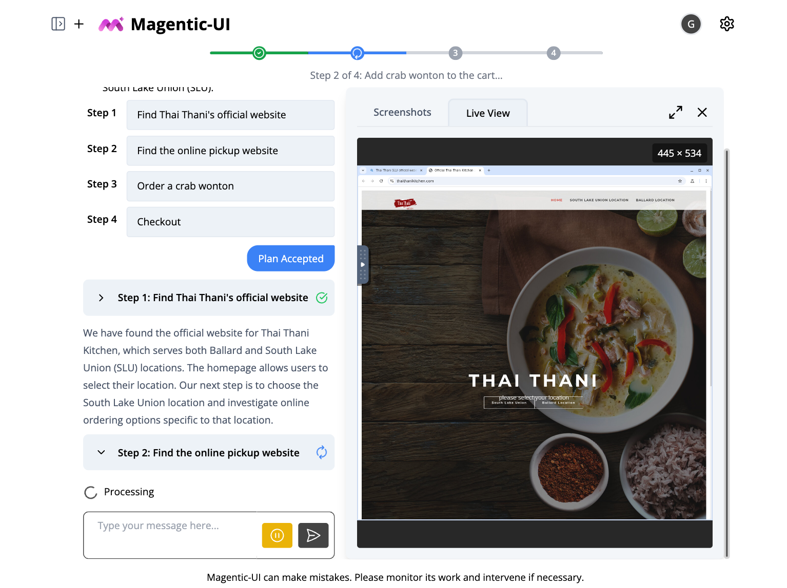
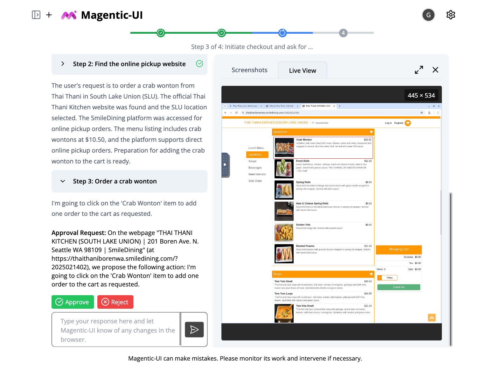
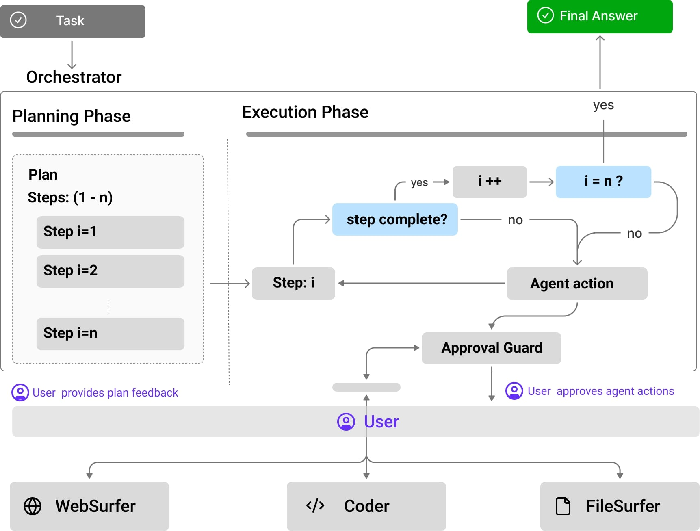

<div align="center">


# Magentic-UI
_Automate your web tasks while you stay in control_

</div>

<!--  -->

<!-- Screenshots -->
<p align="center">
  
  
  
  
</p>

Magentic-UI is a **research prototype** of an agentic web interface for solving complex web tasks. An Orchestrator coordinates four [AutoGen](https://github.com/microsoft/autogen) agents—WebSurfer, Coder, FileSurfer, and UserProxy—to handle browsing, coding, file management, and user feedback, etc. It is designed with user-agent collaboration in mind and offers a transparent, controllable interface. Key features include:

- 🧑‍🤝‍🧑 **Co-Planning**: Collaboratively create and approve step-by-step plans.
- 🤝 **Co-Tasking**: Work together to execute complex tasks, with real-time feedback and control.
- 🛡️ **Action Guards**: Protect sensitive actions with user approvals.
- 🧠 **Plan Learning**: Learn from previous runs to improve future task automation.


Here's how you can get started with Magentic-UI. It's easy to install and run, and you can even build it from source if you prefer.

> **Note**: Before installing, please read the [pre-requisites](#prerequisites) carefully. Magentic-UI requires Docker to run, and if you are on Windows, you will need WSL2. If you are using Mac or Linux, you can skip the WSL2 step.

```bash
python3 -m venv .venv
source .venv/bin/activate
pip install magentic-ui
# export OPENAI_API_KEY=<YOUR API KEY>
magentic ui --port 8081
```


## Table of Contents

- [About Magentic-UI](#about-magentic-ui)
- [How does it work?](#how-does-it-work)
- [How to use?](#how-to-use-magentic-ui)
- [How to use custom clients?](#custom-client-configuration)
- [How to build from source?](#building-magentic-ui-from-source)
- [Contributing](#contributing)
- [Legal Notices](#legal-notices)


## About Magentic-UI

Magentic-UI is a multi-agent system consisting of 5 agents - an Orchestrator that coordinates a team of 4 specialized agents:

- **WebSurfer**: Navigates the web, retrieves information, and interacts with websites
- **Coder**: Writes and executes code to solve programming tasks
- **FileSurfer**: Handles file operations like reading and navigating documents
- **UserProxy**: Interfaces with the human user, collecting feedback and approvals

### How does it work?


<p align="center">
  
</p>

Magentic-UI’s underlying system is a team of specialized agents adapted from AutoGen’s Magentic-One system. The agents work together to create a modular system:
- **Orchestrator** is the lead agent, powered by a large language model (LLM), that performs co-planning with the user, decides when to ask the user for feedback, and delegates sub-tasks to the remaining agents to complete.
- **WebSurfer** is an LLM agent equipped with a web browser that it can control. Given a request by the Orchestrator, it can click, type, scroll, and visit pages in multiple rounds to complete the request from the Orchestrator.
- **Coder** is an LLM agent equipped with a Docker code-execution container. It can write and execute Python and shell commands and provide a response back to the Orchestrator.
- **FileSurfer** is an LLM agent equipped with a Docker code-execution container and file-conversion tools from the MarkItDown package. It can locate files in the directory controlled by Magentic-UI, convert files to markdown, and answer questions about them.

To interact with Magentic-UI, users can enter a text message and attach images. In response, Magentic-UI creates a natural-language step-by-step plan with which users can interact through a plan-editing interface. Users can add, delete, edit, regenerate steps, and write follow-up messages to iterate on the plan. While the user editing the plan adds an upfront cost to the interaction, it can potentially save a significant amount of time in the agent executing the plan and increase its chance at success.

The plan is stored inside the Orchestrator and is used to execute the task. For each step of the plan, the Orchestrator determines which of the agents (WebSurfer, Coder, FileSurfer) or the user should complete the step. Once that decision is made, the Orchestrator sends a request to one of the agents or the user and waits for a response. After the response is received, the Orchestrator decides whether that step is complete. If it is, the Orchestrator moves on to the following step. 

Once all steps are completed, the Orchestrator generates a final answer that is presented to the user. If, while executing any of the steps, the Orchestrator decides that the plan is inadequate (for example, because a certain website is unreachable), the Orchestrator can replan with user permission and start executing a new plan.

All intermediate progress steps are clearly displayed to the user. Furthermore, the user can pause the execution of the plan and send additional requests or feedback. The user can also configure through the interface whether agent actions (e.g., clicking a button) require approval.


## How to Use Magentic-UI

### Prerequisites

1. Magentic-UI requires Docker as part of normal operation. If running on Windows or Mac, you can use [Docker Desktop](https://www.docker.com/products/docker-desktop/).

2. Running Magentic-UI on Windows requires WSL2. You can follow the instructions [here](https://docs.microsoft.com/en-us/windows/wsl/install) to install WSL2. Additionally, be sure that Docker Desktop is configured to use WSL2 (Settings > Resources > WSL Integration). You can find more detailed instructions about this step [here](https://docs.microsoft.com/en-us/windows/wsl/tutorials/wsl-containers).

3. Provide your OpenAI API key to Magentic-UI by setting the environmental variable `OPENAI_API_KEY`. Alternatively, review the [Custom Client Configuration](#custom-client-configuration) section below.

4. You need at least Python 3.10 installed.

### PyPI Installation 

Magentic-UI is available on PyPI. We recommend using a virtual environment to avoid conflicts with other packages.

```bash
python3 -m venv .venv
source .venv/bin/activate
pip install magentic-ui
```

Alternatively, if you use `uv` for dependency management, you can install Magentic-UI with:

```bash
uv venv --python=3.12 .venv
. .venv/bin/activate
uv pip install magentic-ui
```

### Running Magentic-UI

To run Magentic-UI, make sure that Docker is running, then run the following command:

```bash
magentic ui --port 8081
```

The first time that you run this command, it will take a while to build the Docker images -- go grab a coffee or something. The next time you run it, it will be much faster.

Once the server is running, you can access the UI at <http://localhost:8081>.

### Custom Client Configuration

If you want to use a different OpenAI key, or if you want to configure use with Azure OpenAI, you can do so by creating a `config.yaml` file in the `appdir` folder (typically `~/.magentic_ui`).

An example `config.yaml` for OpenAI is given below:

```yaml
# config.yaml

######################################
# Default OpenAI model configuration #
######################################
model_config: &client
  provider: autogen_ext.models.openai.OpenAIChatCompletionClient
  config:
    model: gpt-4o
    api_key: <YOUR API KEY>
    max_retries: 10

##########################
# Clients for each agent #
##########################
orchestrator_client: *client
coder_client: *client
web_surfer_client: *client
file_surfer_client: *client
action_guard_client: *client
```

The corresponding configuration for Azure OpenAI is:

```yaml
# config.yaml

######################################
# Azure model configuration          #
######################################
model_config: &client
  provider: AzureOpenAIChatCompletionClient
  config:
    model: gpt-4o
    azure_endpoint: "<YOUR ENDPOINT>"
    azure_deployment: "<YOUR DEPLOYMENT>"
    api_version: "2024-10-21"
    azure_ad_token_provider:
      provider: autogen_ext.auth.azure.AzureTokenProvider
      config:
        provider_kind: DefaultAzureCredential
        scopes:
          - https://cognitiveservices.azure.com/.default
    max_retries: 10


##########################
# Clients for each agent #
##########################
orchestrator_client: *client
coder_client: *client
web_surfer_client: *client
file_surfer_client: *client
action_guard_client: *client
```


### Building Magentic-UI from source

#### 1. Make sure the above prerequisites are installed, and that Docker is running.

#### 2. Clone the repository to your local machine:

```bash
git clone https://github.com/microsoft/magentic-ui.git
cd magentic-ui
```

or, if using SSH:

```bash
git clone git@github.com:microsoft/magentic-ui.git
cd magentic-ui
```

#### 3. Install Magentic-UI's dependencies with uv:

```bash
# install uv through https://docs.astral.sh/uv/getting-started/installation/
uv venv --python=3.12 .venv
uv sync --all-extras
source .venv/bin/activate
```

#### 4. Build the frontend:

First make sure to have install node:

```bash
# install nvm to install node
curl -o- https://raw.githubusercontent.com/nvm-sh/nvm/v0.40.1/install.sh | bash
nvm install node
```

Then install the frontend:

```bash
cd frontend
npm install -g gatsby-cli
npm install --global yarn
yarn install
yarn build
cd ..
```

#### 5. Run Magentic-UI, as usual.

```bash
magentic ui --port 8081
```


#### Running the UI from source

If you are working on the UI, you can run the frontend in development mode so that it will automatically update when you make changes.

1. Open a separate terminal and change directory to the frontend

```bash
cd frontend
```

3. Create a `.env.development` file.

```bash
cp .env.default .env.development
```

3. Launch frontend server

```bash
npm run start
```

Then run the UI:

```bash
magentic ui --port 8081
```

The frontend from source will be available at <http://localhost:8000>, and the compiled frontend will be available at <http://localhost:8081>.

## Contributing

This project welcomes contributions and suggestions. Most contributions require you to agree to a
Contributor License Agreement (CLA) declaring that you have the right to, and actually do, grant us
the rights to use your contribution. For details, visit https://cla.opensource.microsoft.com.

When you submit a pull request, a CLA bot will automatically determine whether you need to provide
a CLA and decorate the PR appropriately (e.g., status check, comment). Simply follow the instructions
provided by the bot. You will only need to do this once across all repos using our CLA.

This project has adopted the [Microsoft Open Source Code of Conduct](https://opensource.microsoft.com/codeofconduct/).
For more information see the [Code of Conduct FAQ](https://opensource.microsoft.com/codeofconduct/faq/) or
contact [opencode@microsoft.com](mailto:opencode@microsoft.com) with any additional questions or comments.

### How to Contribute

You can help by looking at issues or helping review PRs. Any issue or PR is welcome, but we have also marked some as 'open for contribution' and 'open for reviewing' to help facilitate community contributions. These are ofcourse just suggestions and you are welcome to contribute in any way you like.

<div align="center">

|            | All                                                          | Especially Needs Help from Community                                                                                                      |
| ---------- | ------------------------------------------------------------ | ----------------------------------------------------------------------------------------------------------------------------------------- |
| **Issues** | [All Issues](https://github.com/microsoft/magentic-ui/issues) | [Issues open for contribution](https://github.com/microsoft/magentic-ui/issues?q=is%3Aissue+is%3Aopen+label%3A%22open+for+contribution%22) |
| **PRs**    | [All PRs](https://github.com/microsoft/magentic-ui/pulls)     | [PRs open for reviewing](https://github.com/microsoft/magentic-ui/pulls?q=is%3Apr+is%3Aopen+label%3A%22open+for+reviewing%22)              |

</div>

Please note that all PRs contributing new features are expected to include new tests. You can find existing tests in the `tests` directory.

### Running Tests and Checks

All contributions must pass the continuous integration checks. You can run these checks locally before submitting a PR by running:

```sh
poe check
```

## Legal Notices

Microsoft, and any contributors, grant you a license to any code in the repository under the [MIT License](https://opensource.org/licenses/MIT). See the [LICENSE](LICENSE) file.

Microsoft, Windows, Microsoft Azure, and/or other Microsoft products and services referenced in the documentation
may be either trademarks or registered trademarks of Microsoft in the United States and/or other countries.
The licenses for this project do not grant you rights to use any Microsoft names, logos, or trademarks.
Microsoft's general trademark guidelines can be found at <http://go.microsoft.com/fwlink/?LinkID=254653>.

Any use of third-party trademarks or logos are subject to those third-party's policies.

Privacy information can be found at <https://go.microsoft.com/fwlink/?LinkId=521839>

Microsoft and any contributors reserve all other rights, whether under their respective copyrights, patents,
or trademarks, whether by implication, estoppel, or otherwise.
